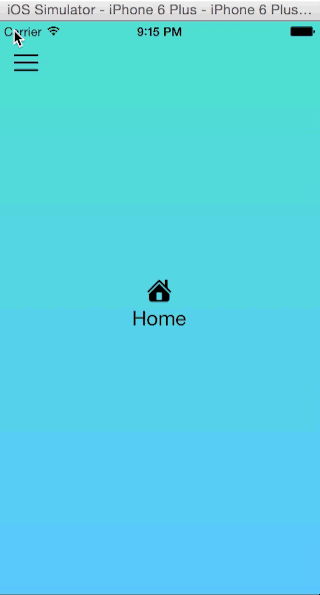

# JVMenuPopover [](http://cocoadocs.org/docsets/JVMenuPopover) [](http://cocoadocs.org/docsets/JVMenuPopover) [](http://cocoadocs.org/docsets/JVMenuPopover)

### Preview 1 - Menu with Background pic

<a href="http://www.youtube.com/watch?feature=player_embedded&v=PeAu5T2dbAk?autoplay=1" target="_blank"></a>

### Preview 2 - Menu without Background pic

<a href="http://www.youtube.com/watch?feature=player_embedded&v=zcLHQHAZeU8?autoplay=1" target="_blank"></a>

### Preview 3 - Menu with Vibrancy

<a href="http://www.youtube.com/watch?feature=player_embedded&v=_9OrMZ7VYDI?autoplay=1" target="_blank"></a>

## Usage

To run the example project, clone the repo, and run `pod install` from the Example directory first.

Using JVMenuPopover with your own project.

* Set your RootViewController in the your AppDelegate.m, you could follow my example project and see how I set a background image to the entire app if you are looking to follow that approach.
    
    * I use one of my helper function in the pods to adjust the image to my device width and not show an expanded image.
    
``` 
- (BOOL)application:(UIApplication *)application didFinishLaunchingWithOptions:(NSDictionary *)launchOptions
{
    // Override point for customization after application launch.
    UIViewController *rootController = [[JVMenuRootViewController alloc] init];

    self.navigationController = [[UINavigationController alloc] initWithRootViewController:rootController];

    self.window = [[UIWindow alloc] initWithFrame:[[UIScreen mainScreen] bounds]];
    [self.window setRootViewController:self.navigationController];
    self.window.backgroundColor = [UIColor colorWithPatternImage:[JVMenuHelper imageWithImage:[UIImage imageNamed:@"app_bg1.jpg"] scaledToWidth:self.window.frame.size.width]];
    self.window.contentMode = UIViewContentModeScaleAspectFit;

    [self.window addSubview:self.navigationController.view];
    [self.window makeKeyAndVisible];

    return YES;
}
```

* Then, we set our navigation controller however we wanted it to be displayed
    
    * Here, I set the menu image I want to display, the color of the menu button and small trick just in my case I wanted to have a transparent navigation bar.

```
- (void)viewWillAppear:(BOOL)animated
{
    [super viewWillAppear:animated];

    self.navigationController.delegate = self;
    self.navigationItem.leftBarButtonItem = [[UIBarButtonItem alloc] initWithImage:self.menuImg style:UIBarButtonItemStylePlain target:self action:@selector(showMenu)];
    self.navigationItem.leftBarButtonItem.tintColor = [UIColor blackColor];

    // make the navigation bar transparent
    [self.navigationController.navigationBar setBackgroundImage:[UIImage new]
    forBarMetrics:UIBarMetricsDefault];
    self.navigationController.navigationBar.shadowImage = [UIImage new];
    self.navigationController.navigationBar.translucent = YES;
    self.navigationController.view.backgroundColor = [UIColor clearColor];
    self.navigationController.navigationBar.backgroundColor = [UIColor clearColor];
}
```

* Finally but not least, I do the animation of the view controllers. So far I found better to take a screenshot after I have finished scaling the current view controller that I am animating.

    * So, from the menu delegates I let the RootViewController know which of my view controller I would like to display, I could also have an NSArray with my controllers in it.
    * After, I do the animations...

```
- (void)closeMenu:(JVMenuPopoverViewController *)JVMenuPopoverViewController
{
    [self.navigationController popToViewController:JVMenuPopoverViewController animated:NO];
}

- (void)setNewViewController:(UINavigationController *)navController fromIndexPath:(NSIndexPath *)indexPath
{
    if(indexPath.row == 0)
    {
        self.mainController = [[JVMenuRootViewController alloc] init];
        self.mainController.view.transform = CGAffineTransformScale(CGAffineTransformIdentity, 0.6, 0.6);
        [navController setViewControllers:@[self.mainController]];
    }
    else if(indexPath.row == 1)
    {
        self.secondController = [[JVMenuSecondController alloc] init];
        self.secondController.view.transform = CGAffineTransformScale(CGAffineTransformIdentity, 0.6, 0.6);
        [navController setViewControllers:@[self.secondController]];
    }
}

- (void)navigationController:(UINavigationController *)navigationController willShowViewController:(UIViewController *)viewController animated:(BOOL)animated
{
    [UIView animateWithDuration:0.3/1.5 animations:^{
        viewController.view.transform = CGAffineTransformScale(CGAffineTransformIdentity, 1.0, 1.0);
    } completion:nil];
}
```

## Requirements

Developed and tested using iOS8+

## Installation

JVMenuPopover is available through [CocoaPods](http://cocoapods.org). To install
it, simply add the following line to your Podfile:

    pod "JVMenuPopover"

## Author & Support

Contact me if you find any bugs or potential room for improvements, which I am sure there are. Jorge Valbuena, jorgevalbuena2@gmail.com. BTW! You are welcome to help in supporting this pod or making improvements to it.

## License

JVMenuPopover is available under the MIT license. See the LICENSE file for more info.

